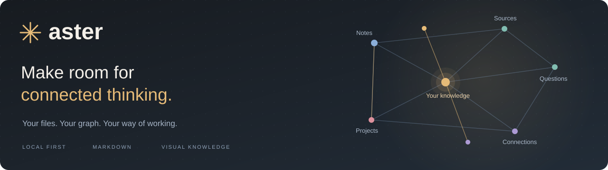
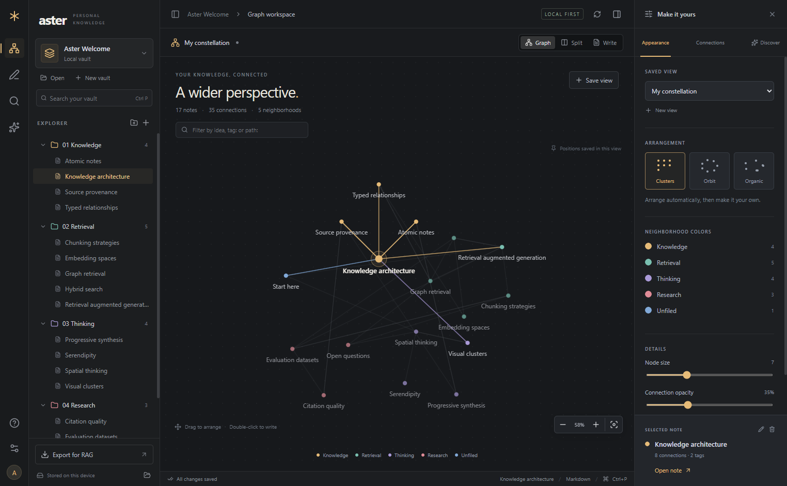
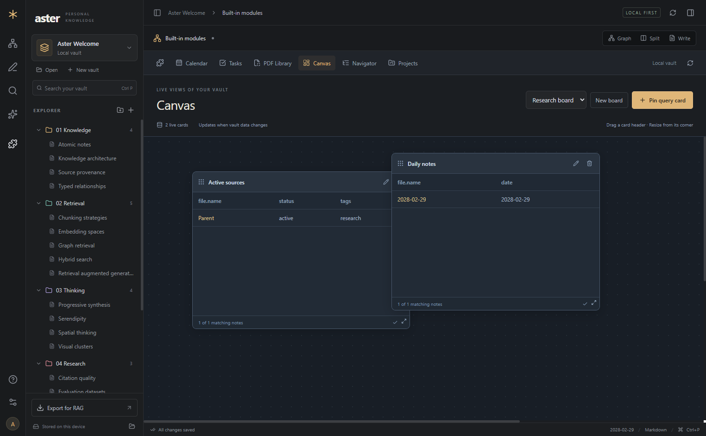
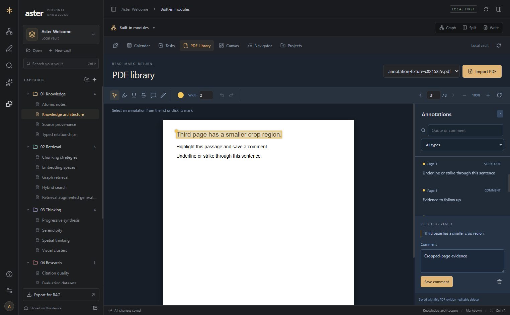
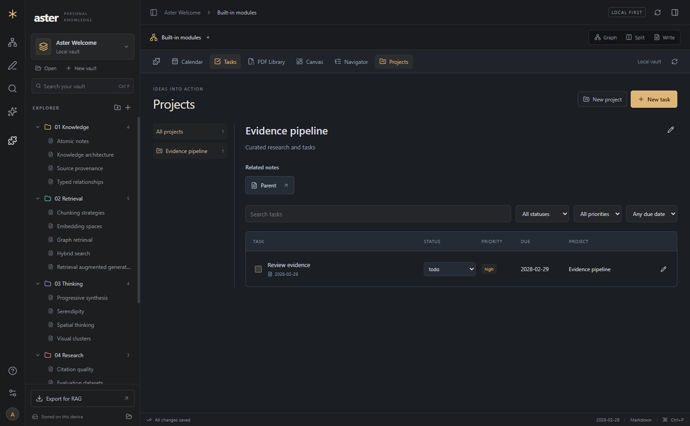
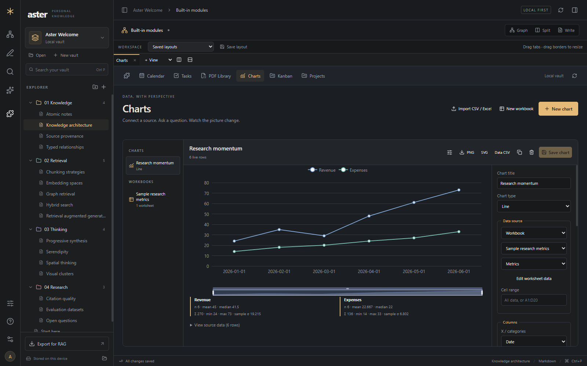
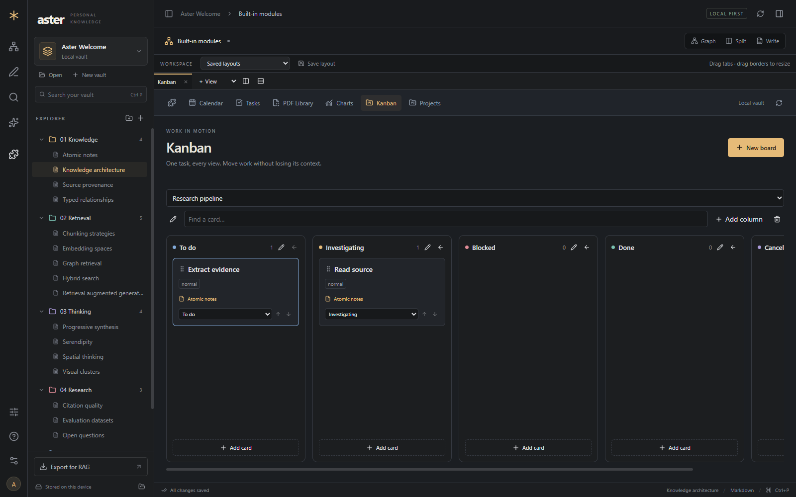
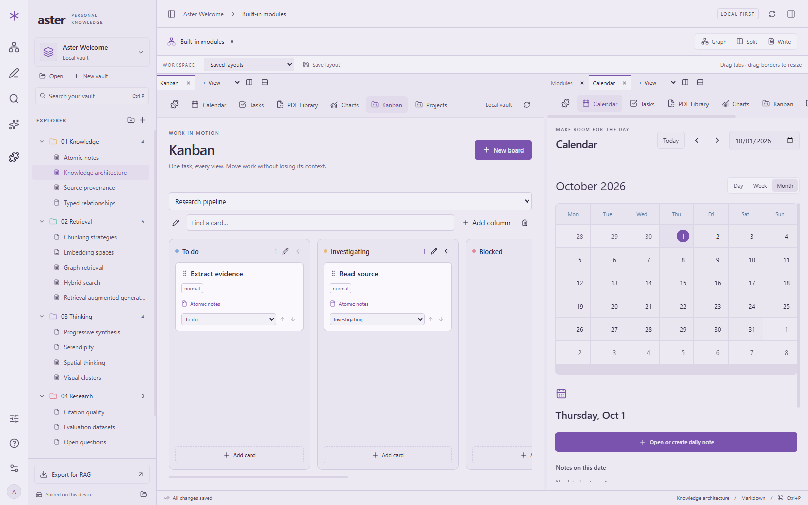

<p align="center">
  
</p>

<p align="center">
  <strong>An open-source, local-first knowledge workspace for visual thinkers, researchers, and people building better RAG datasets.</strong>
</p>

<p align="center">
  <a href="https://github.com/Alfredo12111/Aster/releases">Download for Windows</a> ·
  <a href="docs/GETTING-STARTED.md">Getting started</a> ·
  <a href="docs/FEATURES.md">Feature guide</a> ·
  <a href="CHANGELOG.md">Changelog</a> ·
  <a href="CONTRIBUTING.md">Contribute</a>
</p>

<p align="center">
  
  
  
</p>

---

Aster brings your files, relationships, research, and project work into one workspace. Write in Markdown, shape a graph around the way you think, annotate source documents, and keep live views of your knowledge close at hand.

Your vault is a folder you own. The core experience works without an account, cloud service, API key, or plugin installation.



## A workspace that grows with your thinking

| | What you can do today |
| --- | --- |
| **Write and organize** | Local Markdown vaults, nested folders, search, wiki-link completion, backlinks, formatted preview, and multiple resizable panes, movable tabs, and saved layouts. |
| **Make the graph yours** | Drag and pin nodes, change folder and note colors, add directed relationships, save filtered views, and choose clustered, radial, or force-based layouts. |
| **Find useful connections** | On-device suggestions explain shared concepts. Optionally bring your own AI provider key to review candidate connections. You decide what becomes a link. |
| **Work with dates** | Built-in day, week, and month Calendar views. Open or create daily notes, browse date metadata, and see tasks due that day. |
| **Move projects forward** | Tasks with source notes, excerpts, due dates, statuses, priorities, and projects. Project views bring related notes and tasks together. |
| **Read with a pen in hand** | PDF highlights, underlines, strikeouts, area comments, and freehand ink. Search annotations, jump to their location, and work with rotated or cropped pages. |
| **Keep live answers in view** | Pin Aster Query results to movable, resizable Canvas cards. Tables refresh when the underlying notes change. |
| **Navigate large collections** | Browse a virtualized tree based on folders or frontmatter hierarchy. Combine metadata, folder, and text filters while retaining parent context. |
| **Explore structured data** | Thirteen chart types; live queries and Markdown tables; CSV/XLSX import; editable worksheets, formulas, statistics, trendlines, and PNG/SVG/CSV exports. |
| **Organize work visually** | Native Kanban columns and ordered cards connected to tasks, notes and projects. Moving a card updates task status everywhere. |
| **Arrange your workspace** | Combine any views in up to eight resizable panes, move tabs between panes, and save layouts. Choose Aster, Cyber, Lavender, Deep Ocean, Paper, or Rosewood. |
| **Prepare knowledge for RAG** | Export JSONL chunks with source paths, note IDs, revisions, character spans, tags, and accepted relationships. |

Calendar, Tasks & Projects, PDF Library, Canvas, Navigator, Charts, and Kanban are enabled by default in new vaults. Manage them from the **puzzle icon**. Turning one off preserves its data; existing vault choices are retained.

<table>
  <tr>
    <td width="50%"><br><strong>Live Canvas queries</strong><br>Useful tables, arranged where you need them.</td>
    <td width="50%"><br><strong>Sources you can return to</strong><br>Editable annotations anchored to the original page.</td>
  </tr>
</table>

<details>
<summary><strong>See the project workspace</strong></summary>



Screenshots use generated sample content, not personal vaults.
</details>

## New in 0.3



<table>
<tr><td width="50%"><br><strong>Work connected to your notes</strong></td><td width="50%"><br><strong>A workspace you can shape</strong></td></tr>
</table>

Read the [charts and formulas guide](docs/CHARTS.md), [workspace controls](docs/FEATURES.md#flexible-workspaces), and [remaining addon roadmap](docs/ADDON-ROADMAP.md).

## Start in a few minutes

### Download the Windows app

1. Go to [Releases](https://github.com/Alfredo12111/Aster/releases) and download **Aster-0.3.2-windows-x64.zip**.
2. **Extract the entire ZIP** to a normal folder.
3. Open **Aster.exe** inside it. Keep the accompanying files beside the executable.
4. Explore the welcome vault, or choose **New vault** / **Open** for your own notes.

No Node.js or coding tools are needed for the packaged download. The current build is an unsigned Windows x64 alpha. The release includes a SHA-256 checksum and setup instructions. See [Getting started](docs/GETTING-STARTED.md) for verification, updates, and troubleshooting.

### Run from source

With [Node.js 24+](https://nodejs.org/en/download) and [Git](https://git-scm.com/downloads) installed:

```powershell
git clone https://github.com/Alfredo12111/Aster.git
cd Aster
npm ci
node node_modules/electron/install.js
npm run dev
```

The Electron install command covers npm setups that skip dependency installation scripts. To build a distributable Windows app, run `npm run package`; the result is in `release/win-unpacked/`.

## Your knowledge stays understandable

```text
My Vault/
  Research/
    Retrieval.md
  Daily/
    2026-10-01.md
  Attachments/
    source.pdf
  .aster/
    vault.json       # note identity, graph views, relationships
    modules.json     # tasks, projects, Canvas, PDFs, charts, Kanban, layouts
    history/         # earlier note content
    module-history/  # earlier module state
    trash/           # recoverable deleted notes
```

- **Plain files first.** Notes remain Markdown. Back up the whole vault, including `.aster` and attachments.
- **Explicit AI use.** Provider keys stay encrypted in the app profile, outside the vault. Cloud suggestions send bounded note excerpts only when you request them. Local suggestions need no key.
- **Reviewable changes.** External edit conflicts preserve your draft. Accepted AI links require a user action. PDF originals remain unchanged.
- **No telemetry in this build.** Ordinary local use does not send your notes to a server.

Publication checks exclude credentials, personal vaults, app profiles, local paths, test output, and generated build folders from source control. Release checks inspect the packaged app archive. These checks reduce accidental disclosure; they are not a security certification.

## Aster Query, a small language for useful views

Use the visual builder or write a query directly:

```text
SELECT file.name, status, date
FROM "Research"
WHERE status = "active"
WHERE tags contains "rag"
SORT date DESC
LIMIT 50
```

Pin it to Canvas and watch the results update as notes change. Query evaluation runs in a worker and does not execute arbitrary code. [Read the query reference →](docs/FEATURES.md#canvas-and-aster-query)

## Honest about the alpha

The working modules above are implemented and tested. Charting includes all requested chart families; the worksheet engine is a bounded analysis tool, with documented formula coverage rather than complete Excel compatibility. **Cloud sync, persistent large-vault indexing, OCR, annotated PDF export, a vector database, and an automatic updater are not included.** RAG export produces attributed chunks; it does not run an answering pipeline. PDF annotations use editable Aster sidecars.

Current protective limits are 20,000 Markdown notes, 2 MB per note, 100 MB of total note text, and 100 MB per PDF. These are limits, not performance promises. The app still loads full note snapshots. The metadata navigator is virtualized; the original file explorer is not.

The validation record covers **56 automated tests**, packaged desktop workflows, restart persistence, PDF rotation/crop geometry, a **1,500-note navigation scenario**, and a **10,000-note hierarchy core test**. See [Validation](docs/VALIDATION.md) for the exact scope and remaining gaps.

## Build with us

Aster is built with **Electron, React, TypeScript, CodeMirror, PDF.js**, and a native filesystem repository. The renderer is sandboxed; file operations pass through a validated API. Portable domain models are separated from storage and presentation.

[Architecture](docs/ARCHITECTURE.md) · [Product direction](docs/PRODUCT.md) · [Contributing](CONTRIBUTING.md)

```powershell
npm run build
npm test
npm run test:desktop
npm run test:modules
npm run test:visual
npm run audit:publish
```

Feature changes should update this page, the relevant guide, and the changelog in the same contribution. Versioned releases run build, test, and publication checks before upload.

## License

Aster is released under the [MIT License](LICENSE). You can use, modify, and redistribute it under those terms. Third-party components retain their own licenses; see [THIRD-PARTY-NOTICES.txt](THIRD-PARTY-NOTICES.txt).
