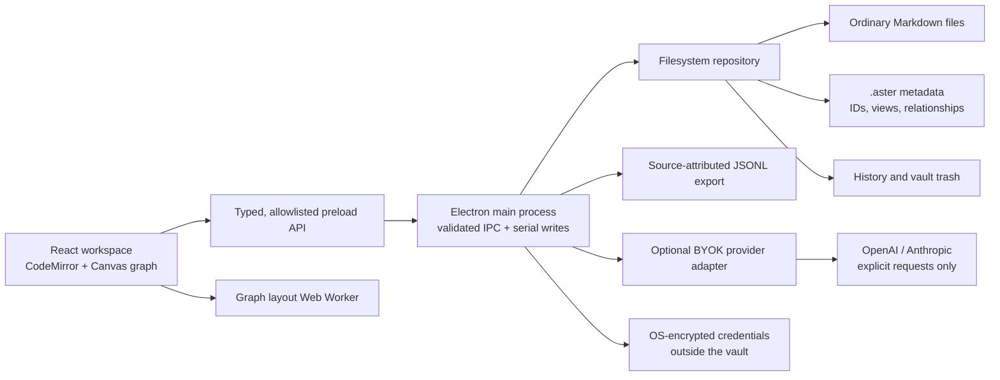
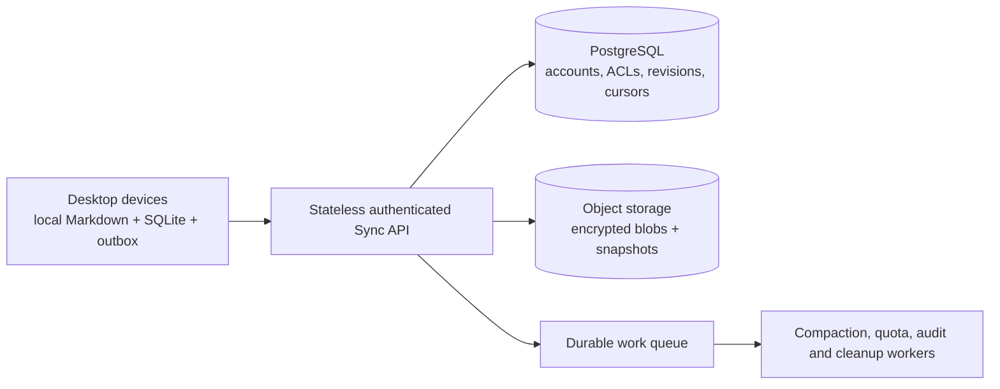

# Aster architecture

Status: working Windows desktop alpha 0.3, 1 October 2026. “Aster” is a working product name.

The product is a local knowledge workbench for visual thinkers and people curating RAG datasets. The durable assets are Markdown notes, stable identities, accepted relationships, source provenance, and independently saved spatial views.

## Implemented boundaries



| Directory | Responsibility |
| --- | --- |
| `packages/core` | Portable note, graph, search, suggestion, sample, and RAG models. `rag.ts` uses Node hashing; UI-facing modules do not import it. |
| `packages/storage-fs` | Native file ownership, path checks, atomic replacement, revision conflicts, history and trash. |
| `apps/desktop/electron` | Window lifecycle, IPC authorization, native dialogs, provider requests, secure keys. |
| `apps/desktop/src` | Workspace presentation, draft lifecycle, editor, Canvas renderer, layout worker. |
| `packages/sync-contract` | Validated, versioned future sync protocol. Not connected to a running service. |
| `docs/cloud-schema.sql` | Proposed PostgreSQL control-plane schema. Not deployed or migration-tested. |
| `tests` / `scripts/smoke.mjs` | Domain, filesystem, provider mock, protocol, and real Electron workflow checks. |

The renderer has no Node privileges, filesystem paths are checked in the host, and IPC only accepts requests from the app's main frame. The window uses a sandbox, context isolation, denied new windows/navigation and denied permission requests. The Markdown renderer does not execute HTML or fetch remote images. All writes go through a serialized repository; model requests do not block file writes.

## Vault format and identity

```text
My Vault/
  Research/
    Retrieval.md
  .aster/
    vault.json            # versioned IDs, accepted relationships and saved views
    modules.json          # versioned optional modules and PDF annotations
    module-history/       # previous module state by revision hash
    history/<note-id>/    # previous content snapshots, named by content hash
    trash/                # recoverable deleted Markdown files
```

Markdown is the content authority. A SHA-256 revision detects a stale save; the draft is retained rather than overwriting an external edit. Writes use a sibling temporary file, flush it, and rename it into place. This prevents partial-file replacement during ordinary failures; it is not a promise of cross-file transactions or protection against hardware failure. Path checks reject traversal, metadata paths, Windows reserved names, and symlinks/junctions inside the vault. These checks are defense in depth against renderer mistakes and attacks, not a hostile multi-process filesystem sandbox.

IDs are UUIDs assigned in the sidecar index. In-app moves preserve IDs. External moves currently receive new IDs because rename reconciliation is not implemented. Do not advertise IDs as surviving arbitrary external renames. Preserve `.aster/vault.json` when moving or backing up an entire vault.

Wikilinks are derived, directional edges. Duplicate links between the same pair yield one edge. Code examples are ignored. Resolution favors a sibling path, then a vault-relative path, then an unambiguous basename. Headings and display aliases are supported for graph resolution. Missing and ambiguous targets do not fabricate a connection. Custom relationships are separate accepted edges with stable IDs and labels. Removing one does not modify note text.

Each graph view owns positions, layout and filter. Colors and display preferences belong to the vault. This separates meaning from presentation and avoids duplicated notes. Automated layout runs in a worker; the Canvas renderer limits offscreen drawing and hides colliding labels.

## Built-in modules and metadata

The complete module surface is documented in [FEATURES.md](FEATURES.md). YAML frontmatter is parsed with bounded size, nesting and alias expansion. Notes carry typed metadata plus a visible parse error, with original Markdown retained. Calendar and query consumers use this same representation.

Module records live in one versioned, validated vault sidecar: per-vault enable flags, date settings, UUID-addressed tasks/projects, Canvas boards/cards and PDF documents/annotations. Writes carry an expected SHA-256 revision, run through the repository queue, save previous state in recovery history, then atomically replace the sidecar. The renderer serializes changes against the latest successful snapshot and discards stale reload responses. Conflicting external sidecar edits require reload. This is whole-sidecar optimistic concurrency, not fine-grained collaborative merging. History currently needs a retention policy.

Aster Query parses a constrained typed language and executes in a dedicated worker. Active Canvas cards re-query on each note-snapshot change. The metadata navigator uses iterative cycle detection and flattening, preserves unresolved nodes, and mounts a bounded row window. The original explorer still renders all expanded notes. Full snapshot refresh and in-memory task/project arrays remain the current storage tradeoff.

PDF.js is lazy-loaded with its worker, fonts, CMaps and decoders bundled locally. Its text-layer CSS is scoped to PDF pages. Native import copies PDFs into Attachments; read operations verify the document hash and vault scope. Rendering and annotation transforms use the PDF viewport and native page coordinates. The renderer keeps one current page canvas/text layer; annotation navigation loads the target page and centers its geometry. PDF bytes stay unchanged. Imported PDF actions/scripts are not executed. The CSP permits WebAssembly compilation for bundled decoders while leaving dynamic JavaScript evaluation disabled.

A future indexed repository should split module records into entity tables with per-entity revisions and a transactional outbox, while retaining readable export sidecars and migration support. Current module records are not yet wired into the proposed cloud protocol. Do not claim module sync or a persistent SQLite index exists.

## RAG contract

The export is newline-delimited JSON: one record per chunk. Each record includes `schema_version`, `vault_id`, `note_id`, `revision`, `chunk_id`, `source_path`, title, tags, chunk ordinal, character start/end offsets, text, and directional relationships with their origin.

Current chunking uses a 1,600-character budget with 200-character overlap, preferring paragraph boundaries. It is **character based**, not a model-token guarantee. The consumer must retokenize for its embedding model. Chunk IDs include the vault and note identity, revision, chunker version/configuration and ordinal; changing the chunking parameters changes the identity. The export does not create embeddings, a vector database, or an answering pipeline. AI suggestions are excluded until accepted.

For the next format version, add extraction provenance (URL, page number, source hash), evidence spans on relationships, note kinds, trust state and document tombstones. Prefer this before adding a generic chat interface.

## Optional AI

The local matcher uses weighted shared terms and tags, excludes existing neighbors, and explains its candidates. It is lexical similarity, not an embedding model. On explicit request, the provider adapter sends the active note and up to 12 candidate excerpts, capped at 6,000 characters each. The AI reranks/explains that shortlist; it does not search the whole vault semantically.

Keys are encrypted by Electron `safeStorage` and stored in the application profile, outside the vault. Plaintext key material is necessarily present in process memory while making a request. Insecure Linux fallback key storage is rejected. Keys are never returned from the preload API. Provider requests use fixed HTTPS origins, refuse redirects, have bounded output and a timeout, and never execute model tools. Returned candidate IDs are validated and deduplicated. Acceptance is always a user action.

OpenAI requests set `store: false`; this does not override provider retention policies. Provider-specific consent, budget controls, retries, batch embeddings and telemetry redaction need further work before public release. Tests use mock provider responses; no live API call has been made in this build.

## Scaling the local product

There are two different scaling problems: one user's large vault and many users of optional services. Local notes should never require an account or network request.

This alpha loads a complete text snapshot into the host and renderer and refreshes the snapshot after file watcher events. It has protective ceilings of 20,000 Markdown files, 2 MB per file and 100 MB of aggregate text. These are safety limits, **not verified usable performance targets**. The file tree is not virtualized. The graph does not yet have multilevel aggregation. The synthetic benchmark measures only core algorithms, not real vault ingestion or interaction latency.

Before a large-vault beta:

1. Add a rebuildable SQLite index in a dedicated utility process. Tables: notes, FTS text, tags, links, sources, chunks, embeddings, and a durable operation outbox. WAL transactions update index rows and outbox entries together. Markdown stays authoritative; a journal reconciles crashes between filesystem and index changes.
2. Replace full snapshots with paginated metadata queries, note-body reads on demand, incremental watch updates and revision-keyed caches. Virtualize the explorer and query results.
3. Build a persistent inverted index for candidate retrieval. Cache provider/model/version-specific embeddings locally; re-embed only changed chunks. Run parsing, chunking and embedding queues outside the UI/main loop.
4. Introduce graph level of detail: folder/topic aggregates, expand on demand, one/two-hop views, edge caps and label prioritization. Switch rendering to WebGL when measured Canvas limits justify it. Keep user-pinned coordinates authoritative across algorithms.
5. Benchmark actual 1k, 10k, 50k and 100k-note corpora, dense graphs, large notes, file storms, external renames, concurrent edits, antivirus interference, crashes and disk-full cases. Establish hardware-specific p95 targets before making performance claims.

## Optional cloud service design



Use a modular service first. Horizontally scale stateless API instances; separate workers from user-facing requests. Vault ID is the isolation and partition key. Put blob bytes in object storage and transactional metadata in PostgreSQL. Place an index on `(vault_id, sequence)` for incremental pulls. Split hot tenants/regions only after measuring contention. Redis may support rate limits and presence, but must never be the only durable copy of an operation.

Every operation has an idempotency ID, device ID, entity ID, base revision, content digest and key version. The host must authenticate the principal, check active vault membership, validate blob ownership and enforce quotas before every operation. Never trust `vaultId` or `deviceId` as authorization. Duplicate requests return the original result. Allocate the per-vault sequence and commit the revision, operation and outbox event in one transaction. A stale base revision returns a conflict; preserve both versions rather than relying on device timestamps. Tombstones are retained until the supported offline-device horizon has passed.

Push and pull use bounded pages, opaque cursors, backpressure and exponential retry with jitter. Resume blob uploads by content hash. A client outbox survives restarts; only delete an entry after a durable acknowledgment. Initial sync uses a consistent snapshot plus the subsequent log. Account deletion requires tombstones, retention policy and verified object cleanup.

Default to end-to-end encrypted sync using reviewed cryptographic libraries and a separate per-vault key. Key recovery, device revocation, rotation and authenticated metadata must be designed and audited before launch. **An E2EE server cannot perform plaintext full-text/vector search on that vault.** Keep search and embeddings local, or provide a distinct, explicitly consented server-processing mode. Do not promise both invisible server access and server-side semantic processing.

The current protocol models revision conflicts; it is not a CRDT implementation. If live collaborative editing becomes a requirement, adopt and test a document CRDT (for example Yjs) behind the same repository boundary, with compaction and a deterministic Markdown materialization policy. Retrofitting a homegrown character merge algorithm is not an acceptable shortcut.

## Release gates

- Native signed builds, installer/update signatures and rollback; Windows/macOS/Linux packaging matrices.
- Durable settings/rename journal, external rename reconciliation, attachment and large-file handling, bounded history retention, backup/restore UI.
- Vault migration tests, portable ZIP import/export, parser edge cases and Markdown compatibility corpus.
- Accessibility/keyboard audit, 200% scaling, graph alternatives, virtualized large vaults and memory profiling.
- For cloud: running service, RLS tests, integration/chaos/load tests, rate limits, tenant quotas, restoration drills, revocation checks, encryption audit and operational ownership.
- No third-party plugin execution until a capability boundary, signing/trust model and crash isolation are designed.

Sources checked for the implementation: [Electron security](https://www.electronjs.org/docs/latest/tutorial/security), [Electron IPC](https://www.electronjs.org/docs/latest/tutorial/ipc), [OpenAI Responses](https://developers.openai.com/api/docs/guides/migrate-to-responses), [Anthropic API authentication](https://platform.claude.com/docs/en/manage-claude/authentication).

## Charts and pane architecture (0.3)

The portable core now contains schemas for recursive pane layouts, chart specifications, worksheets, and Kanban columns/card ordering. Older version-1 sidecars receive default empty collections. Workspace trees validate unique IDs, active tabs, depth and pane/tab bounds. Theme and layout state live with the vault.

A single React module provider serializes mutations across panes and checks the sidecar revision. Note-file changes and module-file changes use separate notifications; resizing or switching themes does not trigger a full note rescan. Chart/workbook editors also check their base record to reject stale edits. A vault switch flushes active worksheet/chart editors.

Chart calculations run in disposable workers. Source adapters normalize Aster queries, Markdown tables and imported worksheets. The mathematical core handles aggregation, Welford sample variance, compensated sums, inclusive quantiles, histograms, Tukey boxes, Gaussian density estimates, Pearson correlation, trailing averages and centered/scaled QR regressions. ECharts renders charts; ExcelJS handles bounded XLSX imports and calculated-value exports. Formula libraries use parsed expressions with bounded reference depth/count and worker lifetime. Native exports validate format and use a user-selected save path.

These collections still share the revisioned module JSON file and history snapshots. A large user base does not imply a deployed service: the existing SQLite/index and optional sync designs remain future infrastructure. Imported workbooks are local snapshots; there is no external workbook synchronization.

## Connected workspace (0.4)

Resource pins store a stable node UUID plus a typed reference to an existing module record. Catalog adapters supply current titles and virtual map paths; graph/tree nodes never duplicate editable workbook, task, PDF or board data. Source-derived edges describe actual chart inputs, project membership and task origins. Manual relationships remain in vault settings and use the same pin identities. Missing resources stay visible rather than silently retargeting links.

Connection evidence stores immutable quote snapshots plus source identity, note revision/span or PDF fingerprint/annotation version/page. Review compares the current saved record; opening PDFs independently checks their bytes. This is provenance capture, not proof that a claim is true. Full document extraction and retrieval-time freshness evaluation remain future work.

The visual tree reuses the cycle-safe folder/metadata hierarchy and an iterative layout with a bounded 600-card viewport result. Source rows remain fixed during worksheet filtering/sorting. Structural workbook operations repair A1 formulas and chart sources in one serialized module transaction; undo patches guard against overwriting later chart-source changes. Formula XLSX export permits known functions and blocks external references.


## Bundled organization demo (0.5)

`packages/demo` generates a fully native Pelagic Labs vault with stable note/tool IDs, relative paths, synthetic data, formulas, current evidence snapshots, and saved layouts. Three original PDF assets and their annotation anchors ship under `dist/demo` inside the app archive. No app profile, credentials, or personal vault is bundled.

First launch with no saved root creates the demo in a sibling staging directory, validates its schema, then renames it into place. Windows sharing errors receive a bounded retry. An existing root is never reseeded, and explicit New vault remains empty. The vault:demo API accepts no filesystem path and creates or reopens only the dedicated demo copy. UI switching flushes pending edits before adopting another vault. Demo dates are anchored once at creation; restarts do not rewrite dates or content.

The release includes an optional audited synthetic-vault ZIP. It deliberately contains its own .aster records, unlike the application ZIP, which contains build-only resources. Demo source generators and PDF assets are tracked; exported vaults, profiles, binaries, and screenshots from private data are excluded.
